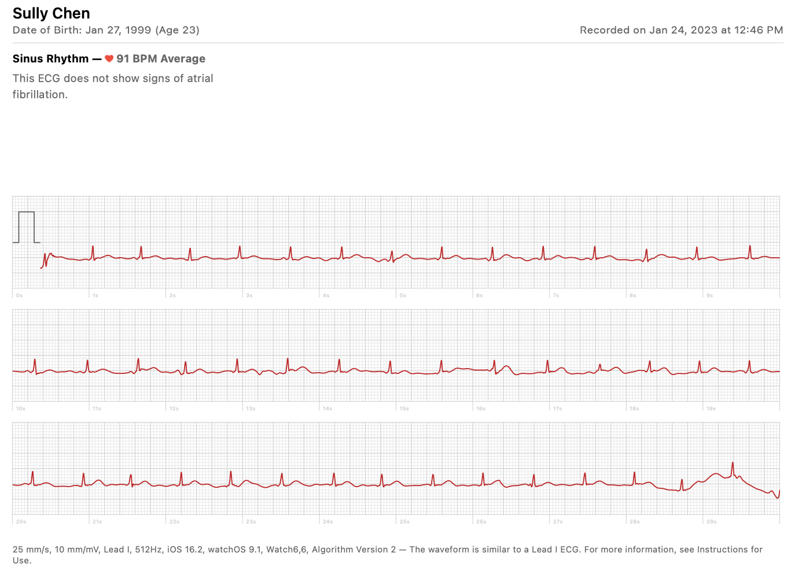
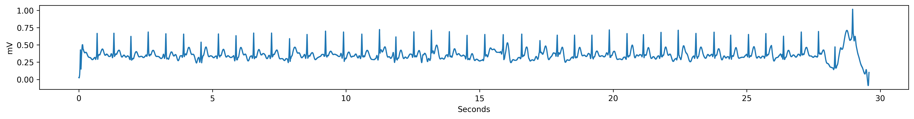

# Extract Apple Watch ECG
Apple Watches can take a lead I ECG and export a PDF of the reading. This library takes that PDF and uses CV to extract the metadata and ECG trace to a numpy file.

## Requirements
`pip install opencv-python scipy numpy pdf2image PyPDF2`

You may also need to install Poppler for PDF rendering.

## Usage
`python parse_apple_watch_ECG.py [filename]`

Output: 
- A `.npy` file that has the ECG data in it, scaled to mVs, 
- A `.json` file with the ECG metadata in it.

Alternatively, you can import process the ECG in Python:
```
from parse_apple_watch_ECG import process_pdf

ecg, metadata = process_pdf(filename)
```

Where `ecg` is a numpy array, and `metadata` is a python dict.

## Example
Input:


Output:


Metadata: `{"frequency": 512, "Name": "Sully Chen", "DOB": "Jan 27, 1999", "Age": 23, "Recording time": "Jan 24, 2023 at 12:46 PM"}`
